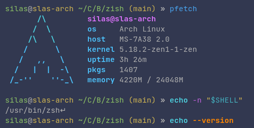

# zsh "zish" theme
This is a basic theme for zsh based on `fish`s default look. It previously lived in my [linux stuff repo](https://github.com/RubixDev/HandyLinuxStuff).



Notable differences from fish are:
- hostname is colored yellow even when not connected via ssh
- the prompt arrow is not `>`, but `»`

## Installation
To use this theme, first make sure you have `zsh` and [oh-my-zsh](https://github.com/ohmyzsh/ohmyzsh) installed. For correct syntax highlighting also install the [zsh-syntax-highlighting](https://github.com/zsh-users/zsh-syntax-highlighting) plugin.
You can then download the `zish.zsh-theme` file into your `ZSH_CUSTOM` directory (`~/.oh-my-zsh/custom` by default):

```bash
curl https://raw.githubusercontent.com/RubixDev/zish/main/zish.zsh-theme -o "${ZSH_CUSTOM:-${ZSH:-$HOME/.oh-my-zsh}/custom}/themes/zish.zsh-theme"
```
**or**
```bash
wget https://raw.githubusercontent.com/RubixDev/zish/main/zish.zsh-theme -O "${ZSH_CUSTOM:-${ZSH:-$HOME/.oh-my-zsh}/custom}/themes/zish.zsh-theme"
```

Afterwards you can set `ZSH_THEME="zish"` in your `~/.zshrc`.
